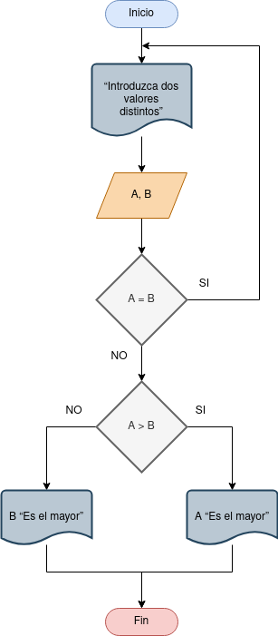

# Ejercicios

- [Ejercicio 1](#ejercicio1)

## Ejercicio 1 

Desarrolle un algoritmo que permita leer dos valores distintos, determinar cual de los dos valores es el mayor y escribirlo.

### Diagrama de Flujo

### Pseudocódigo

Pasos:

- Inicio

- Inicializar variables: A = 0, B = 0

- Solicitar la introducción de dos valores distintos

- __Leer__ los dos valores

- Asignarlos a las variables A y B

- __Si__ A = B __Entonces__ vuelve a 3 porque los valores deben ser distintos

- __Si__ A>B __Entonces__ 
__Escribir__ A, “Es el mayor”

- __De lo contrario: Escribir__ B, “Es
el mayor”

- __Fin_Si__

- __Fin__

