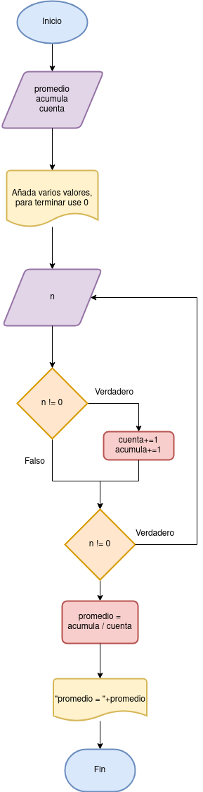

# Tarea 8 

## Descripción del ejercicio

Desarrolle un algoritmo que permita calcular Promedio de Notas; finaliza cuando N = 0.

## Diagrama de flujos

     

## Pseudocódigo

1. Inicio
2. Declaración de Variables:
N = 0, Promedio = 0, Acumula= 0
3. Hacer
4. Leer N
5. si N != 0
6. Cuenta = Cuenta + 1
7. Acumula = Acumula + N
8. fin si
9. Mientras N != 0
10. Promedio = Acumula/Cuenta
11. Imprimir “Promedio = ” + Promedio;
12. Fin

# Bucles y Condiciones 2

## Descripción del ejercicio

El ejercicio consiste en escribir un programa que encuentre e imprima todos los números perfectos en un rango dado (por ejemplo, entre 1 y 1000).

## Diagrama de flujos

     

## Pseudocódigo

1. Inicio
2. imprimir "Añada el primer numero de la cadena"
3. Pedir el valor "primero"
4. imprimir "Añada el ultimo numero de la cadena"
5. Pedir el valor "ultimo"
6. mientras (primero > ultimo)
7. declarar int i, int suma = 0, int n, n = primero
8. para (i = 1; i < n; i++)
9. si (n % i == 0)
10. suma = suma + i;
11. fin si
12. fin para
13. si (suma == n)
14. imprimir "Perfecto"
15. sino
16. imprimir "No es perfecto"
17. primero++
18. fin mientras
19. fin

