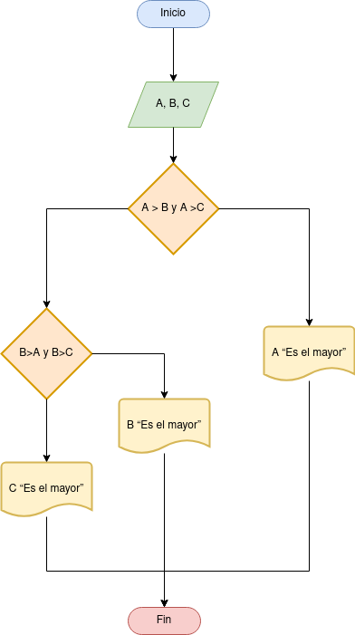

# Indice

- [Tarea 2](#tarea2)
- [Tarea 3](#tarea3)

# Tarea 2 

## Descripción del ejercicio

Desarrolle un algoritmo que permita leer tres valores y almacenarlos en las variables A, B y C respectivamente. El algoritmo debe imprimir cual es el mayor y cual es el menor. Recuerde constatar que los tres valores introducidos por el teclado sean valores distintos. Presente un mensaje de alerta en caso de que se detecte la introducción de valores iguales.

## Diagrama de flujos

     

## Pseudocódigo

1. Inicio
2. Inicializar las variables A, B y C
3. Leer los tres valores
4. Almacenar en las variables A, B
y C
5. Si A > B y A > C Entonces
6. Escribir A “Es el mayor”
7. Sino
8. Si B > A y B > C Entonces
9. Escribir B “Es el mayor”
10. Sino
11. Escribir C “Es el mayor”
12. Fin_Si
13. Fin_Si
14. Fin

## Referencias

# Tarea 3 

## Descripción del ejercicio

Desarrolle un algoritmo que realice la sumatoria de los números enteros comprendidos entre el 1 y el 10, es decir, 1 + 2 + 3 + …. + 10. Utilia un buble __for__ y un bucle __while__.

## Diagrama de flujos

     

## Pseudocódigo

1. Inicio
2. Declaración de variables:
N= 0, Suma = 0
3. Asignación Contador :
N = N + 1
4. Asignación Acumulador:
Suma = Suma + N
5. Si N = 10 Entonces
6. Escribir Suma
7. De lo contrario, Repetir desde el
paso 3
8. Fin_Si
9. Fin

## Referencias

# Tarea 4 

## Descripción del ejercicio

Desarrolle un algoritmo que permita leer un valor cualquiera N y escriba si dicho número es par o impar.

## Diagrama de flujos

     

## Pseudocódigo

1. Inicio
2. Declaración de variables: N
3. Leer un número
4. Asignarlo a la variable N
5. Si el residuo de dividir a N entre 2 es
igual a cero
6. Si es Si: Entonces: Escribir “ Es par”
7. Sino: Escribir “Es impar”
8. Fin_Si
9. Fin

## Referencias

# Tarea 5 

## Descripción del ejercicio

Desarrolle un algoritmo que permita leer dos números y ordenarlos de menor a mayor, si es el caso.

## Diagrama de flujos

     

## Pseudocódigo

1. Inicio
2. Declaración de Variables:
A = 0, B = 0, Temporal = 0
3. Leer A y B
4. Si A<B Entonces
5. Asignar a Temporal = B
6. Asignar a B = A
7. Asignar a A = Temporal
8. Si no (De lo contrario)
9. Fin_Si
10. Escribir “Orden = “, A, B
11. Fin

## Referencias

# Tarea 6 

## Descripción del ejercicio

Desarrolle un algoritmo que permita leer un valor entero positivo N y determinar si es primo o no.

## Diagrama de flujos

     

## Pseudocódigo

1. Inicio
2. Declaración de variables:
J = 2, S =0
3. Leer N
4. Mientras J<= N / 2 hacer
5. Si N / J =0
6. S=S+1
7. J=J+1
8. Fin_Si
9. Fin del ciclo mientras
10. Si S = 0 Entonces
11. Escribir N “es primo”
12. Sino (De lo contrario)
13. Escribir N “no es primo”
14. Fin_Si
15. Fin

## Referencias

# Tarea 7 

## Descripción del ejercicio

Realice un algoritmo que a partir de proporcionarle la velocidad de un automóvil, expresada en kilómetros por hora, proporcione la velocidad en metros por segundo.

## Diagrama de flujos

     

## Pseudocódigo

1. Inicio
2. Declaración de Variables:
Vel = 0
3. Leer Datos: Vel
4. Versal = (Vel * 1000) / 3600
5. Imprimir resultado
6. Fin

## Referencias

# Tarea 8 

## Descripción del ejercicio

Desarrolle un algoritmo que permita calcular Promedio de Notas; finaliza cuando N = 0.

## Diagrama de flujos

     

## Pseudocódigo

1. Inicio
2. Declaración de Variables:
N = 0, Promedio = 0, Acumula= 0
3. Leer N
4. Mientras N <> 0 hacer
5. Cuenta = Cuenta + 1
6. Acumula = Acumula + N
7. Fin Mientras
8. Promedio = Acumula/Cuenta
9. Imprimir “Promedio:”; Promedio
10. Fin

## Referencias

# Tarea 9 

## Descripción del ejercicio

Muestra los números del 1 al 100 (ambos incluidos). Usa un bucle while.

## Diagrama de flujos

     

## Pseudocódigo

## Referencias

# Tarea 10 

## Descripción del ejercicio

Haz el mismo ejercicio anterior con un bucle for.

## Diagrama de flujos

     

## Pseudocódigo

## Referencias

